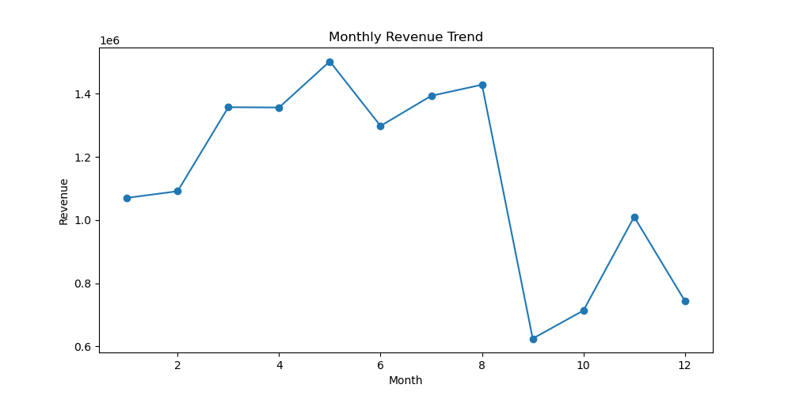
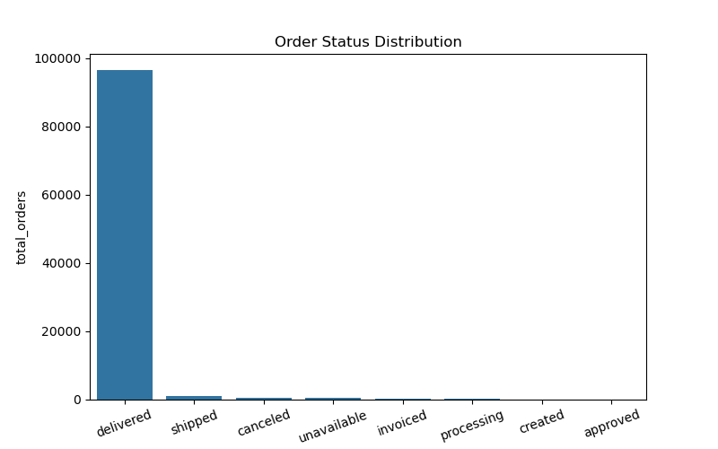
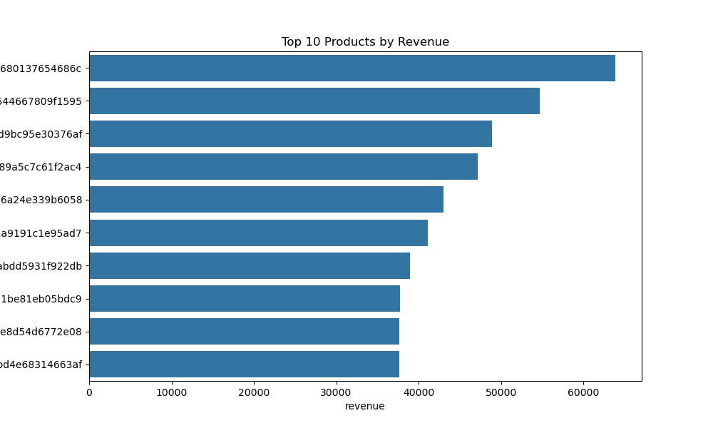
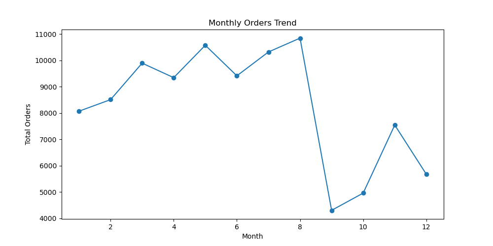
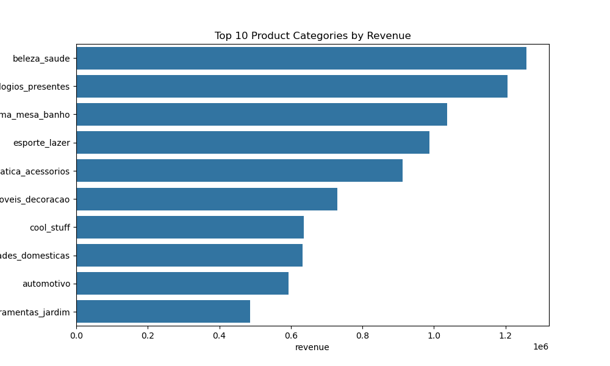
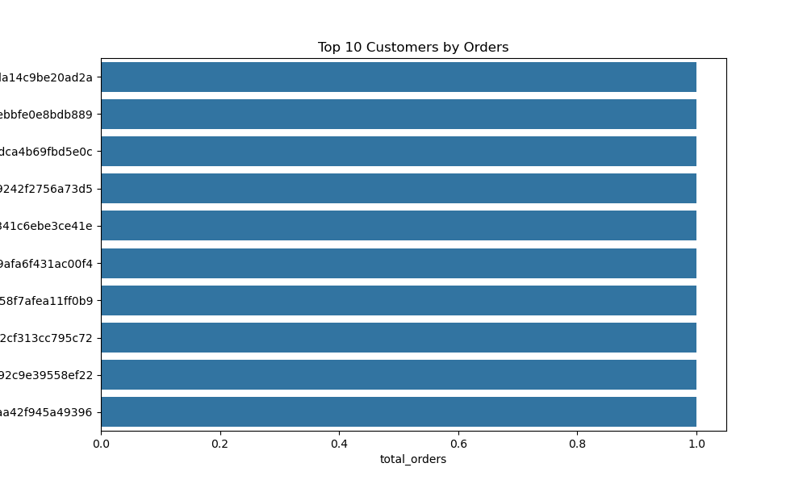

# Day 2 - E-Commerce Sales Analysis using SQL & Python

## Project Overview

This project is part of my **31 Days Data Analytics & Data Science Challenge**.

In this project, I performed E-Commerce Sales Analysis using **SQL and Python** to analyze customer orders, revenue trends, product performance, and business KPIs.

The project focuses on extracting business insights from relational databases using SQL queries and visualizing trends using Python.

---

## Tools & Technologies Used

- SQL
- MySQL
- Python
- Pandas
- Matplotlib
- Seaborn
- Jupyter Notebook
- Git & GitHub

---

## Project Workflow

1. Data Collection
2. Importing CSV files into MySQL
3. Database Creation
4. SQL Queries & Business Analysis
5. KPI Analysis
6. JOIN Operations
7. Python + SQL Integration
8. Data Visualization
9. Business Insights
10. Conclusion

---

## Datasets Used

The following datasets were used from the Olist Brazilian E-Commerce Dataset:

- orders
- order_items
- customers
- products

---

## SQL Concepts Used

- SELECT
- WHERE
- GROUP BY
- ORDER BY
- JOIN
- Aggregate Functions
- HAVING Clause
- KPI Queries
- Revenue Analysis
- Customer Analysis

---

## KPIs Analyzed

- Total Revenue
- Total Orders
- Monthly Revenue Trend
- Top Products by Revenue
- Top Customers
- Order Status Distribution
- Product Category Revenue
- Average Product Price

---

## Business Analysis performed 

### Revenue Analysis

- Monthly Revenue Trend
- Revenue by Product Category
- Top Revenue Generating Products

### Customer Analysis

- Top Customers by Orders
- Customer Purchase Trends

### Order Analysis

- Order Status Distribution
- Monthly Orders Trend

---

## Key Business Insights

- Revenue varied significantly across months.
- A few products generated very high revenue compared to others.
- Delivered orders dominated the order status distribution.
- Certain product categories contributed major business revenue.
- Top customers contributed a large number of total orders.

---

# Project Visualizations

## Monthly Revenue Trend


---

## Order Status Distribution


---

## Top Products by Revenue


---

## Monthly Orders Trend


---

## Product Category Revenue


---

## Top Customers by Orders


---

## Conclusion

This project helped me understand:

- SQL-based business analysis
- Relational database concepts
- JOIN operations
- KPI extraction
- Python + SQL integration
- Data visualization
- Business insights generation

Overall, this project strengthened my practical understanding of SQL and Data Analytics workflows.

---

# Project Structure

```bash
Day2_SQL_Ecommerce_Analysis/
│
├── charts/
├── data/
├── insights/
├── notebook/
├── sql_queries/
│   └── analysis_queries.sql
│
├── import_to_mysql.py
└── README.md

----
## Author

Gayatri Chavhan 
Python | SQL | Data Analytics | Business Intelligence
